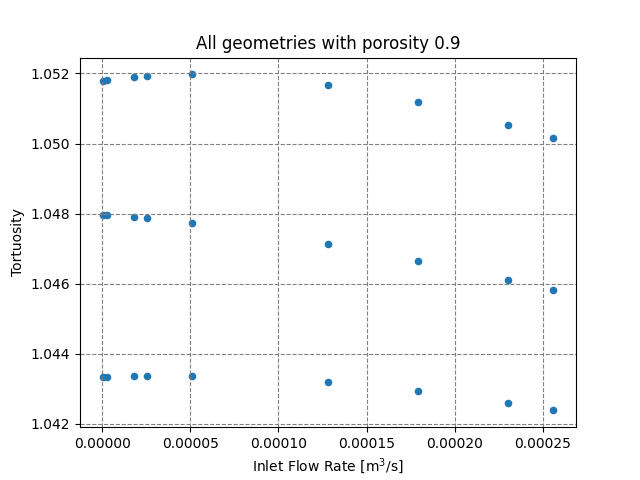

# FPM — Flow through Porous Media

[](https://github.com/SniezekD/FPM/actions/workflows/python-tests.yml)
[](https://github.com/SniezekD/FPM/actions/workflows/flake8.yml)
[](https://github.com/SniezekD/FPM/actions/workflows/docker-image.yml)


A toolchain for running OpenFOAM simulations of fluid flow through randomly generated
porous media. It automates the whole loop, from generating the pore geometry to
writing out post-processed transport metrics, and an experiment is described by a
single config file.

## Overview

Studying flow through porous media usually means building an OpenFOAM case by
hand for every geometry and flow condition: you generate the pore structure, mesh
it, write the boundary conditions and solver dictionaries, run the solver, then
reduce the output to the quantities you actually care about. FPM does that loop
for you. You describe an experiment in one config file (the geometry, the mesh,
the boundary conditions, and a sweep over porosities and velocities), and it
builds the OpenFOAM cases, runs them, and collects a table of transport metrics.

## Status and scope

FPM is a research toolchain, built primarily as a real PhD/MSc simulation workflow
turned into a maintainable, reproducible, tested system. It solves one problem
well rather than many partially.

**What it does:** steady-state, single-phase, incompressible flow through
randomly generated (Swiss-cheese) porous media, swept over porosity and inlet
velocity, reduced to transport metrics.

**What it deliberately does not do (yet):**
- Transient, multiphase, compressible, or turbulent flow — the pipeline targets
  steady laminar `simpleFoam` and validation assumes it.
- Real (imaged/CT) pore geometries — media are procedurally generated, not
  imported.
- Mesh-independence or solver-convergence studies — these are the user's
  responsibility; FPM automates case generation and reduction, not numerical
  verification of a given case.
- General-purpose CFD — the OpenFOAM case structure is templated for this class
  of problem, not arbitrary geometries or physics.

Issues and questions are welcome. It isn't actively seeking outside
contributions, but the design is meant to be readable and extendable.

### Natural extensions

The architecture leaves room for, but does not implement: imported pore
geometries, additional media models beyond Swiss-cheese, and a single-command
`run.sh` wrapper (noted in Quick start). These are intentionally out of scope
for the current version.

## Pipeline

1. **Geometry.** Generate a random porous medium at a target porosity, with
   configurable obstacle sizes and boundary periodicity (`fpm/media_models`).
2. **Case generation.** Render a complete OpenFOAM case (blockMesh, snappyHexMesh,
   boundary conditions, solver dictionaries) from Jinja templates
   (`fpm/openfoam_case.py`, `fpm/templates/`).
3. **Simulation.** Solve steady incompressible flow with `simpleFoam`, sweeping
   over the configured inlet velocities.
4. **Post-processing.** Reduce each flow field to transport metrics (tortuosity,
   participation number, rho-minus, and inlet flow rate), collected into a single
   `results.csv` with per-case plots (`fpm/utilities`).

## Results




Every run writes a `results.csv` to the results directory. 
All quantities are in standard OpenFOAM units or are dimensionless:

| porosity | velocity | tortuosity | participation_number | rho_minus | inlet_flow_rate |
| -------- | -------- | ---------- | -------------------- | --------- | --------------- |
| …        | …        | …          | …                    | …         | …               |

## Quick start

You need **Docker**; the image bundles OpenFOAM v2306 and everything else.

Build the image. The `UID`/`GID` build args make files written to your mounted
results directory owned by you rather than by root:

```bash
docker build --build-arg UID=$(id -u) --build-arg GID=$(id -g) -t fpm .
```

Run an experiment, mounting a results directory and a config:

```bash
mkdir -p results
docker run -it \
    -v "$PWD/results":/results \
    -v "$PWD/examples/experiment_config.toml":/work/config.toml:ro \
    fpm bash -c \
    "source /usr/lib/openfoam/openfoam2306/etc/bashrc && \
     cd /home/repos/FPM && \
     poetry run python scripts/automatic_runner.py --config-path /work/config.toml"
```

The metrics CSV, plots, and archived cases land in `./results` and stay there
after the container exits. A single-command `run.sh` wrapper is planned; for now
this is the entry point.

## Defining an experiment

Everything about a run lives in one TOML file: geometry, mesh, boundary
conditions, solver options, and the porosity/velocity sweep. The table structure
follows OpenFOAM's own dictionaries (`case.controlDict`, `mesh.blockMesh`,
`case.boundaryConditions`, and so on). The config is validated when it loads, so a
missing key, a wrong type, or an out-of-range value fails right away with a clear
message instead of somewhere deep in a running simulation.

There's a fully commented reference at
[`examples/experiment_config.toml`](examples/experiment_config.toml); copy it and
edit.

## Engineering notes

A few notes on how it's put together:

- **Config is validated data.** Experiments are TOML, parsed with the standard
  library's `tomllib` (no YAML dependency), and validated with plain dataclasses
  rather than a framework like Pydantic. Invalid input fails at load time with a
  specific message, not partway through a run.
- **Cases are templated.** The OpenFOAM dictionaries are generated from Jinja
  templates instead of written by hand per case, so there's one place that defines
  case structure.
- **Runs are reproducible.** OpenFOAM lives in the container, so nothing depends
  on a host install. The config is copied into the output directory so a results
  folder describes itself, and `foamToVTK` writes one self-contained `.vtk` per
  case rather than a multi-block series.
- **Dependencies are locked.** Poetry lockfile, one pinned Python version.
- **It's tested.** The suite covers config validation, the coordinate/index
  mappers, the transport metrics, and case generation, and runs in CI on every
  pull request alongside flake8 and the Docker build.

## Development

You don't need OpenFOAM to work on the code or run the tests:

```bash
poetry install
poetry run pytest
poetry run flake8 fpm scripts tests
```

## Project layout

```
fpm/
  io/            config parsing, validation, VTK/spec readers
  media_models/  porous-medium geometry generation
  geometry/      geometric primitives
  utilities/     porosity, tortuosity, and other post-processing metrics
  templates/     Jinja templates for OpenFOAM case files
scripts/         command-line entry points (runner, post-processing)
examples/        reference configuration
tests/           pytest suite
```

## License

MIT. See [LICENSE](LICENSE).
